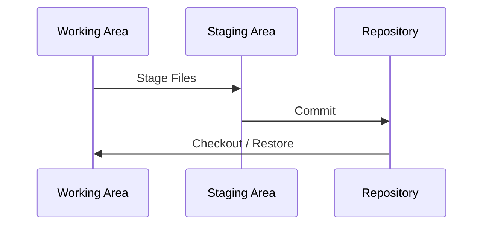
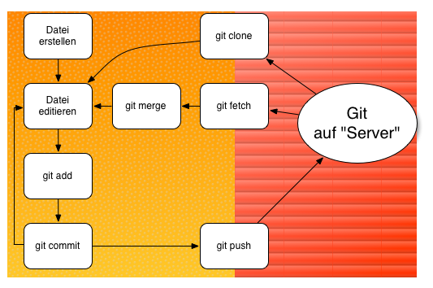

# Einführung in Git

Philipp Weißmann

[mail@philipp-weissmann.de](mailto:mail@philipp-weissmann.de)

---
layout: intro
---

# Agenda

* Motivation
* Einführung
* Hintergrund
* Konzepte und Arbeiten mit Git
* Tipps, Quellen und Links
* Fragen, Fragen, Fragen

---
layout: intro-image-right
image: 'https://i0.wp.com/devs.wiresmithtech.com/wp-content/uploads/2015/01/geek-and-poke-version-control.jpg'
---

#[Simply Explained](https://i0.wp.com/devs.wiresmithtech.com/wp-content/uploads/2015/01/geek-and-poke-version-control.jpg)

---
layout: bullets
---

# Motivation für Versionsmanagement

* Dateien sichern
  * Sicherungskopie
  * Versionen
* Dokumentation von Arbeitsschritten
* Zusammenarbeit
  * Austausch
  * Konkurrierende Änderungen

---

# Historie

* 2005 von L. Torvards gestartet
* Ziele:
  * Verteilt
  * Sicherheit gegen Verfälschung
  * Effizienz
* 10 Jahre Git: Beliebtestes Versionsmanagementsystem

---
layout: statement
---

# Git verfolgt Änderungen von Inhalten

---

# Eigenschaften 1

- Verteilt / Dezentral: Kein Server notwendig
- Entwicklung in Zweigen (*Branching*)
- Datentransfer unabhängig von Dienst
  - `file`, `http`, `https`, `ftp`, `rsync`, Email, ...
- Kryptografisch sicher (*Hashes*, *Signaturen*)

---

# Eigenschaften 2

- Läuft auf allen großen Betriebssystemen
- Schnell und leichtgewichtig
- Viele Workflows möglich
- Kostenlos und frei

---

# Installation
- Linux, BSDs, etc.:
  - Meist schon installiert, Paketmanager
- macOS:
  - Schon installiert, neuere Version: Installationspaket, Homebrew oder Macports
- Windows:
  - Installationspaket

Empfohlener Download: [Offizielle Homepage](https://git-scm.com/download/)

---

# Setup
Einstellungen werden an 3 Orten gespeichert:
  * Systemweit
    * `gitconf`
  * Benutzerglobal
    * `BENUTZER-VERZEICHNIS/.gitconfig`
  * Projektspezifisch
    * `PROJEKT-VERZEICHNIS/.git/config`

---

# Setup
* Emailadresse und Name einstellen:
```bash
git config --global user.name "Philipp Weißmann"
git config --global user.email "mail@philipp-weissmann.de"
```

- Editor einstellen:
```bash
# Notepad++
git config --global core.editor "'c:\Program Files\Notepad++\notepad++.exe' -multiInst -notabbar -nosession -noPlugin"

# Visual Studio Code
git config --global core.editor "code --wait"

# nvim
git config --global core.editor "nvim"

# vim
git config --global core.editor "vim"

# nano
git config --global core.editor "nano"
```

- Etliche Editoren brauchen Kommandozeilenoptionen!

---

# Zustände



---

# Commit

```bash
git commit -m "NACHRICHT"
```

oder interaktiv (öffnet Editor)

```bash
git commit
```

* Änderungs-Set
* Atomar
* Beschreibung

---
layout: intro-image-right
image: 'https://geekandpoke.typepad.com/.a/6a00d8341d3df553ef0133ecdfd99d970b-pi'
---


#[The first check-in of the day](https://geekandpoke.typepad.com/.a/6a00d8341d3df553ef0133ecdfd99d970b-pi)

---

# Zu Commit Nachricht


  * Nachvollziehbare, kurze Nachricht
  * Beschreibung der Änderung auf logischer Ebene
  * Commit editieren:

```bash
git commit --amend
```

Beispiele:
- *Changes API from sqlite2 to sqlite3*
- *Fixes printer LF32 Bug*
- *Work*
- *Change to Worker.cs*

---

# Zu Commit Größe

  - Commit early
  - Commit often
  - Eine Änderung, ein Commit
  - Jeder Stand sollte *lauffähig* sein

---

# Zustand: Checkout Projekt


---

# Switch

## Auf einen vorhanden Zweig wechseln

```bash
git switch DATEINAME
```

## Auf einen alten Stand wechseln:
```bash
git switch --detach COMMIT_ID
```
  * Achtung: Ohne neuen Branch befindet man sich im "detached head state", d.h. es können keine Änderungen commited werden

## Aus "detached head state" zurückkehren:

```bash
git switch -
# alternativ
git switch ZWEIGNAME
```


---

# Restore & Reset
## Eine Datei zurücksetzen:
```bash
git restore DATEINAME
```

## Alle Dateien auf gegebenen Stand setzen:
```bash
git reset --hard VERSION
```

* z.B. Zurücksetzen des Projektes auf den 'main' Stand vom Server 'origin'
```bash
git reset --hard origin/main
```

---

# Checkout
- `checkout` erledigte die Aufgabe von `restore` UND `switch` gleichzeitig
- Empfehlung: `switch` und `restore` einzeln verwenden.


---

# Workflow


---


# Vorhandenes Repository benutzen
```bash
# Aus Verzeichnis
git clone /pfad/zu/repository
# via SSH
git clone user@server:repostory
# via HTTPS
git clone https://server/repository
# Konkretes Beispiel:
git clone https://github.com/jnv/lists.git
```

---

# Unterschied darstellen:
```bash
git diff
```

z.B.
```bash
git diff DATEINAME
```

oder `git diff` für alle Änderungen
- Stellt Unterschiede dieser Datei dar (jetzt zu "letzter Stand")
- Kann ältere Versionen vergleichen

---

# Commits ansehen

```bash
git log
```
  - Zeigt (alle) commits an:

```
commit 465d5a1e23bf7c65cd2c7531cb8897533a5d10e1
Merge: c8bd6d0 6e1cc6f
Author: Jan Vlnas <jnv@users.noreply.github.com>
Date:   Tue Sep 29 10:44:43 2015 +0200

    Merge pull request #70 from deephacks/jvm

    Add awesome-jvm

commit c8bd6d03b522232c69503db27b62c53fa2ce07c1
Author: Jan Vlnas <jnv@users.noreply.github.com>
...
```

---

# Commits ansehen

Anzeige extrem personalisierbar, z.B.
```bash
git log --oneline --decorate
```

```
465d5a1 (HEAD -> master, origin/master, origin/HEAD) Merge pull request #70 from deephacks/jvm
c8bd6d0 Add awesome-opensource-documents
30bba1f Add awesome-promises
6885317 Add awesome-rails-gem
18ea885 Add Resources-for-Writing-Shaders-in-Unity
6e1cc6f Loosely low level, performance related JVM stuff
878757c Fix desc for Fresh-Node.js-Library-Collection
5d3c5e4 Add Fresh-Node.js-Library-Collection
c4abb5f Add awesome-android-performance
0faf86f Add idaplugins-list
6dbce72 Fix link for bookmarklets
53ae3e5 Add awesome-awesome-awesome
512f62c Add awesome-osx
9821b39 Add neural-network-papers
f088a53 Merge pull request #68 from tomasbedrich/master
a3f4b7a Add big-list-of-naughty-strings
f83fcb6 Add awesome-gyazo
19a9dcb Merge pull request #67 from peterkokot/patch-jquery
```

---

# Commits ansehen
```bash
git log --color --graph --pretty=format:"%Cred%h%Creset -%C(yellow)%d%Creset %s %Cgreen(%cr) %C(bold blue)<%an>%Creset" --abbrev-commit
```

```
* 3f414f7 Add learn-tt  Jan Vlnas, 80 minutes ago
*   209db94 Merge pull request #55
|\
| * 264147b Adds Awesome-ConservationTech
|/
*   2272531 Merge pull request #54
|\
| * cb446f8 Fixed typo
|/
*   703f1bd Merge pull request #53
|\
| * c44a93e Add awesome-gulp
|/
* 71ef478 Add AngularJS-Learning and AngularJS2-Learning
```

---

# Exkurs: Eigene Kommandos

* Eigene Kommandos können in der Konfiguration angelegt werden
* Beispiel: Datei an vorhandenen Commit einfügen

```bash
git commit --amend --no-edit
```

soll eigenen Befehl bekommen

```bash
git config --global alias.commend 'commit --amend --no-edit'
```

- Anwendung:
```bash
git add filereader.cpp
git commit -m "Adds capabilities of reading files"
# Oh je...- Datei Vergessen!
git add filereader.h
git commend
```
---

# Exkurs: Eigene Kommandos
## Beispiel: Neues Projekt:
```bash
git config --global alias.it '!git init && git commit -m "Erster Commit" --allow-empty'
```
## Wirklich alles 'Stashen'
```bash
git config --global alias.stashall 'stash --all'
```
## Hübsches git log (siehe zuvor)
```bash
git config --global alias.lg "log --color --graph --pretty=format:'%Cred%h%Creset -%C(yellow)%d%Creset %s %Cgreen(%cr) %C(bold blue)<%an>%Creset' --abbrev-commit"
```

---

# Inhalt eines Commits ansehen

```bash
git show VERSION
```

z.B.
```bash
git show 6885317
```

---

# Inhalte eines Commits

```
commit 6885317d6275be672a4a78de300231f4b2688952
Author: Jan Vlnas <jnv@users.noreply.github.com>
Date:   Fri Sep 25 13:09:49 2015 +0200

    Add awesome-rails-gem

diff --git a/README.md b/README.md
index 9104311..d9df5cb 100644
--- a/README.md
+++ b/README.md
@@ -477,6 +477,7 @@ List of useful, silly and [awesome](#awesome-) lists curated on GitHub. Contribu
 * [awesome-rails](https://github.com/dpaluy/awesome-rails) by @dpaluy
 * [awesome-rails](https://github.com/ekremkaraca/awesome-rails) by @ekremkaraca – Projects and sites made with Rails.
 * [awesome-rails](https://github.com/ruby-vietnam/awesome-rails) by @ruby-vietnam – Rails libraries/app examples/ebooks/tutorials/screencasts/magazines/news.
+* [awesome-rails-gem](https://github.com/hothero/awesome-rails-gem) – Ruby Gems for Rails development.
 * [awesome-react](https://github.com/enaqx/awesome-react) – ReactJS tools, resources, videos.
 * [awesome-recommender-system](https://github.com/Geek4IT/awesome-recommender-system) – Recommender System frameworks, libraries and software.
 * [awesome-redux](https://github.com/xgrommx/awesome-redux) – Resources for [Redux](https://github.com/gaearon/redux), the predictable state container.
```

---

# Branching

- Motivation:
  - Entwicklung und Änderungen durchführen, ohne den Main-Branch stören
  - Ist normales Vorgehen bei gemeinsamer Entwicklung

---

# Branch(es) anzeigen:

```bash
git branch
```

- Zeigt (lokal) verfügbare Branches an und welcher gerade aktiv ist

---

# Auf vorhandenen Branch wechseln:

```bash
git switch BRANCHNAME
```

- Wechselt auf schon vorhandenen Branch

z.B.
```bash
git switch add_scanner_support
```

Alter Befehl dafür:
```bash
git checkout BRANCHNAME
```

---

# Branch erstellen:

```bash
git switch -c BRACHNAME
```

- Legt neuen Branch an

z.B.
```bash
git switch -c feature/add_scanner_support
```

Alter Befehl dafür:

```bash
git checkout -b feature/add_scanner_support
```

---

# Branching Tipps
Tipps:
* Branch Namen mit "/" gruppieren
* Ein Branch pro Aufgabe
* Branches kosten nichts
* Branches können auf den Server übertragen werden
* Ungebrauchte Branches löschen

---

# Branches zusammenführen: Merge
- Beim Abschluss eines Branches (z.B. Aufgabe komplett) soll dieser in einen andere (z.B. *main*) Branch überführt werden
- Wechsle in den Ziel-Branch (hier: *master*)
  - `git merge BRANCH`
  - z.B. `git merge bug/burning_printer`

---

# Versionsstände markieren: Tagging

```bash
git tag TAG-BEZEICHUNG
```
z.B.

```bash
git tag v1.2.0 1b2c3d4f
git tag my_favorite_version 4400440
```

---

# Änderungen zurücksetzen
`git reset`
- Tipp: Fast jede Situation ist in der Hilfe von `git reset` beschrieben.
- Hilfe unter `git reset --help` konsultieren!

---

# Änderungen "parken": Stash

`git stash`

```bash
# "Parkt" Änderungen an Projekt lokal
git stash
# Wie "lokales" Commit, jedoch nicht in History; Kann ausgegeben werden
git stash list
# Kann wieder appliziert werden:
git stash apply
# ... und dann entfernt werden:
git stash drop
# Alternative: Anwenden und entfernen:
git stash pop
```

---

## Erweitertes Stashen:

```bash
# Kann "de-appliziert" werden:
git stash show -p | git apply -R
# Alternativ:
git config --global alias.stash-unapply '!git stash show -p | git apply -R'
# Ab dann
git stash-unapply
# Neuen Branch aus Stashes
git stash branch "feature/adds_password_manager"
```

---

# Änderungen abholen
```bash
git fetch
```
- Abholen von Änderungen aus gemeinsamen Repository (dezentral!)
- Änderungen werden (noch) nicht angewendet

---

# Änderungen anwenden

```bash
git merge
```

- Zusammenführen von 2 Branches
  - (z.B. entfernter Branch und lokaler Branch *master*)
```bash
git pull
```
  - Führt `git fetch` und `git merge` in einem aus
- Tipp: Anfangs `git fetch` und `git merge` manuell ausführen!
-
---
layout: intro-image-right
image: 'https://geekandpoke.typepad.com/.a/6a00d8341d3df553ef0134885909e0970c-pi'
---

#[Merge Konflikte vermeiden](http://geekandpoke.typepad.com/geekandpoke/2010/10/being-a-code-made-easy-chapter-1.html)

---

# Änderungen hochladen

```bash
git push
```

- Commits auf den Server übertragen
- Bei erstem push Serverangabe und Branch notwendig:
  - z.B. `git push origin main`
  - *origin*: Standard Servername
  - *main*: Standard Branch
- Falls der Server noch nicht bekannt ist:
  - `git remote add origin SERVER`
  - z.B. `git remote add origin git@github.com:jnv/lists.git`

---

# Merge Konflikte
- Tritt nur bei Widersprüchen auf
- Bei Konflikten müssen diese gelöst werden
- Manuelles Editieren von Dateien notwendig
- Zusammengeführte Dateien mit `git add` markieren

---

# Merge Beispiel
- Beispielsituation:
  - Beim Versuch zu mergen (z.B. via `git pull`) entsteht ein Konflikt
  - Der Konflikt in der Datei wird in die Datei geschrieben
```ts {all|3,5|2,4,6|all}
Anzahl der Planeten im Sonnensystem:
<<<<<<< HEAD
Neun
=======
Acht
>>>>>>> branch-a
```

* Durch Editieren muss der Konflikt gelöst werden
* Am Ende fertige Dateien hinzufügen (`git add`) und comitten (`git commit`)

---

# Alle lokalen Änderungen verwerfen:
```bash
# Neueste Version von Server holen
git fetch origin
# Kompletter Reset des Branches 'main'
git reset --hard origin/main
```

---
# Online Services
- Github http://github.com
- Gitlab http://gitlab.com
- Bitbucket http://bitbucket.org
- Eigene Server:
  - Gitosis
  - Gitolite
  - Gitlab
  - Gitea (Empfehlung)

---
# Git statt ...
- Brückentools
- Eingebaut oder Zusatztools
- Migration oder Brücke

---

# Git mit Subversion
- Git kann als Brücke zu Subversion genutzt werden
- Alle Commits von Subversion werden lokal geladen (Kann lange dauern)
- Lokale Commits können auf Subversion Server gepusht werden
- Mehr Informationen: Stichwort [git-svn](https://git-scm.com/docs/git-svn)

---

# Git mit TFS
- Git kann als Brücke zu TFS genutzt werden
- Von Microsoft selbst initiiert
- Projekthomepage: [github.com/git-tfs/git-tfs](https://github.com/git-tfs/git-tfs)

---


# Deployment via Git?
- Hooks
- z.B. Deploy (http://deployhq.com)


---

# Fortgeschrittenes
## Rebasing
- Basis eines Branches auf den neuesten Stand verschieben

```bash
git switch feature/add_sqlite3_support

```

```bash
git rebase main
```

---

## History verändern
- Lässt einen alle Commits neue schreiben (z.B. zusammenfassen)

z.B. `git rebase -i feature/add/sqlite3/support`
- Achtung: Erfordert i.d.R. `git push --force`, was die History verändert.
- Dies ist bei gemeinsamen Arbeiten i.d.R. nicht möglich
- Übung: https://github.com/derphilipp/schulung_git_example_rebase

---
## Cherry-Picking

- Ermöglicht Auswahl von zu nutzenden Commits
- Nur mit hoher Entwicklerdisziplin und temporären Einsatz praktikabel
- Siehe `git cherry-pick`

---
# Arbeiten mit Github
* Bei Entwickeln auf Github (u.a.) ist folgender Workflow üblich:
  * Eigenen Fork erstellen
  * Auf eigenen Fork commiten
  * Bei abgeschlossener Aufgabe "Pull-Request" stellen
  * Als Projekt-Maintainer: Pull-Request reviewen, annehmen

---

# Aliase

``` toml
  cleanup = "clean -xfd"
  please = push --force-with-lease
  uncommit = reset --soft HEAD^
  obranch = branch --list --no-merged
  prev = log -1 -p
  preprev = log -2 -p
```

---

# Eigene Farben
``` toml
[color]
    ui = auto
[color "status"]
    added = green
    changed = yellow
    untracked = red
```

---


# Eigene Diff-Farben
``` toml
[color "diff-highlight"]
    oldNormal = red bold
    oldHighlight = red bold 52
    newNormal = green bold
    newHighlight = green bold 22
```

---

# Vertipper Helfer

``` toml
[help]
    autocorrect = 1
```

---

# Submodule parallel laden
``` toml
[submodule]
    fetchJobs = 8
```

---

# Gelöschte Branches auch lokal löschen
``` toml
[fetch]
    prune = true
```

---

# Submodule mit "fetchen"

``` toml
[fetch]
    recurseSubmodules = yes
```

---

# GUIs:
* gitk (Sehr rudimentär, in git oft eingebaut, OpenSource)
* Git Extensions (Windows, Open Source)
* Git Kraken (Privat Kostenlos, macOS, Windows, Linux, Datenschutz!)
* Source Tree (Kostenlos, macOS, Windows, Datenschutz!)
* Gitup (MacOS, Open Source)
* Github Desktop (Kostenlos, macOS, Windows)
* GitX (Open Source, macOS)
* TortoiseGit (Windows) (Warnung!)

---

# Integration:
- Praktisch jede moderne IDE
- Qualität/Anwendung schwankt extrem
- Visual Studio ab 2015

---

# Plugins (1):

## VSCode
* [Git Graph](https://marketplace.visualstudio.com/items?itemName=mhutchie.git-graph)
* [Git Lens](https://marketplace.visualstudio.com/items?itemName=eamodio.gitlens)

## (n)vim
* [GitGutter](https://github.com/airblade/vim-gitgutter)
* [Vim Fugitivee](https://github.com/tpope/vim-fugitive)

---

# Plugins (2)
## Zsh
* [Oh my zsh](https://github.com/robbyrussell/oh-my-zsh)

## Fish
* [Oh my fish](https://github.com/oh-my-fish/oh-my-fish)

---

# Weiterführendes und Quellen
## Weiterlesen:
- Chacon, Straub "Pro Git Book", Apress, https://git-scm.com/book/de
- Loelinger, McCullough "Version Control with Git: Powerful tools and techniques for collaborative software development", Oreilly, 2012

## Quellen
- Vortrag von Gareth Hall - Introduction to Git Version Control, 2013
- Pro Git Book https://git-scm.com/book/de

## Weitermachen
- [Try Git](https://try.github.io)

---

# Cheat Sheets
- [Flight Rules](https://github.com/k88hudson/git-flight-rules)
- [Github](https://services.github.com/kit/downloads/github-git-cheat-sheet.pdf)
- [NDP Software](http://ndpsoftware.com/git-cheatsheet.html)
- [Zack Rusin](http://www.cheat-sheets.org/saved-copy/git-cheat-sheet.pdf)
- [Git Tower](https://www.git-tower.com/blog/git-cheat-sheet-de)
- [Rawgit](https://rawgit.com/pastjean/git-cheat-sheet/master/git-cheat-sheet.svg)

---

# Wenn alles schlimm ist
- [Cheatsheet](http://justinhileman.info/article/git-pretty/git-pretty.png)

---

# Kontakt:
- Philipp Weißmann
- [mail@philipp-weissmann.de](mail@philipp-weissmann.de)
